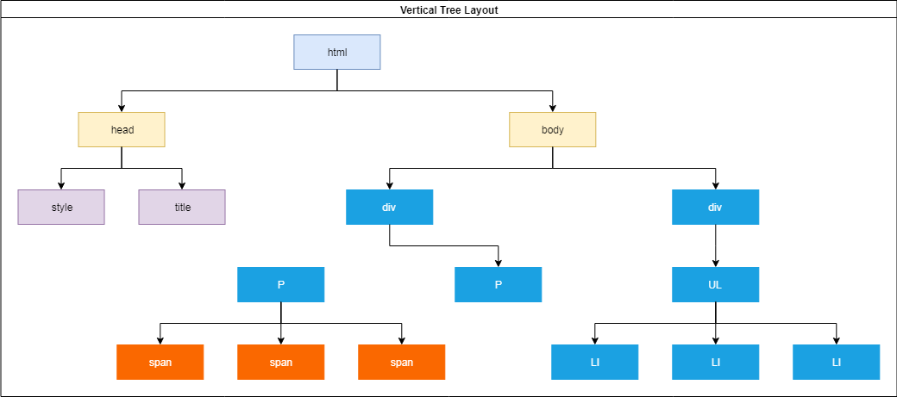

# Front End Website met basic Javascript - Fase 2
In de tweede variant werken we netjes met de broncode van de Javascript in 
een los bestand. Ook de stylesheet is verhuisd naar een los bestand. Typisch zet 
je deze in een eigen map (js en css).

Probleem is wel dat je niet precies weet wanneer je HTML klaar is om te
gebruiken in Javascript. Daarom gebruiken we de functie

```javascript
window.onload
```

Hier kun je een functie (anoniem of functienaam) aan toekennen die uitgevoerd wordt als de
HTML klaar is met laden ([Link naar MDN](https://developer.mozilla.org/en-US/docs/Web/API/GlobalEventHandlers/onload)).

Tevens gaan we aan de slag met het concept van de DOM : het "Document Object Model".

## DOM
Daarna gaan we aan de slag met het maken van een stukje interactieve website: zelf een stukje 
HTML aan de *DOM* toevoegen, zodat we er op kunnen klikken met de muis.

DOM: Document Object Model
Als de browser HTML heeft opgehaald gaat hij een boomstructuur bouwen, waarin alle elementen en object in opgeslagen worden.
We noemen dit de DOM: *het Document Object Model*. In onderstaande afbeelding zie je een voobeeld van zo'n boom.


In de tweede afbeelding hier onder zijn de elementen uitgebreid door er een klasse ('class') of een HTML *id* aan toe te voegen.
Een klasse wordt weergegeven door de naam van het element (P, SPAN, DIV) aan te vullen met een punt ('.') gevolgd door
de klasse naam / namen. Als een element een ID heeft, wordt deze typisch weergegeven met een hash ('#').


## Referenties:
  * [Document Object Model](https://nl.wikipedia.org/wiki/Document_Object_Model)
  * [GetElementByID](https://developer.mozilla.org/en-US/docs/Web/API/Document/getElementById)
  * [CreateElement](https://developer.mozilla.org/en-US/docs/Web/API/Document/createElement)
  * [documentElement](https://developer.mozilla.org/en-US/docs/Web/API/Document/documentElement)
  * [eventHandler](https://developer.mozilla.org/en-US/docs/Web/API/EventListener)