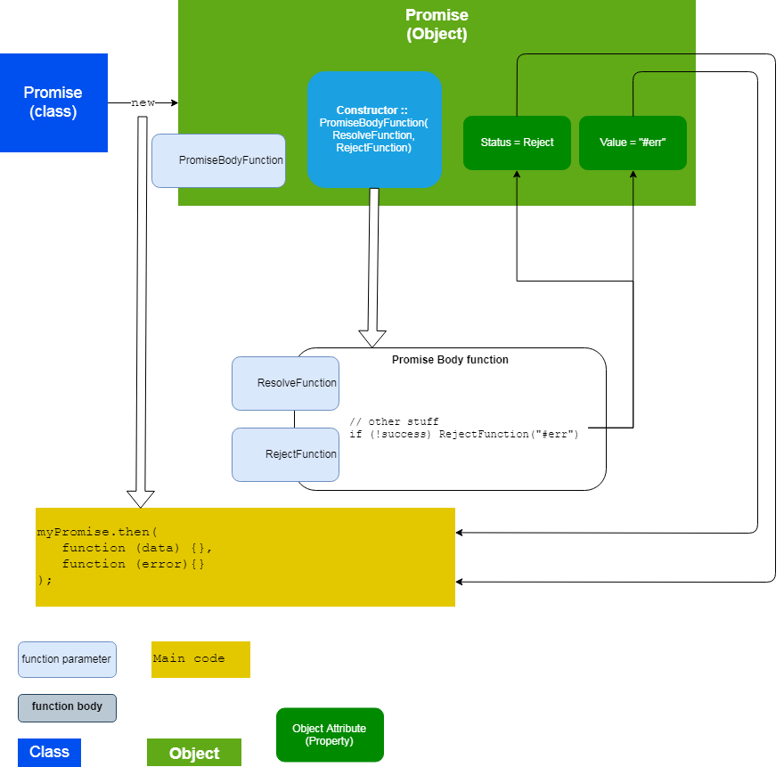

# Opdracht 14 - Promises 2 - then

We gaan in deze opdracht verder met Promises. We gaan nu kijken hoe we de resterende code daadwerkelijk tot uitvoering 
kunnen laten komen. Dat gaat met de functie `then`:

```javascript
  myPromise.then(.....);
```

De `then`-functie heeft meerdere parameters:
  * onResolve-functie
  * onReject-functie
  
De tweede is optioneel. Om de code uit te voeren breiden we dus onze code uit als volgt:
```javascript
  var myPromise = new Promise(myPromiseHandler);

  myPromise.then(
      function(data){resolveFunction(data)},
      function(errormessage){rejectFunction(errormessage)}
   );
```

of verkort : 
```javascript
myPromise.then(resolveFunction, rejectFunction   );
```

Schematisch ziet dat er als volgt uit:


of



Dit kan met de zogenaamde Arrow-notation verkort worden weergegeven:
```javascript
  var myPromise = new Promise(myPromiseHandler);

  myPromise.then(
      data => resolveFunction(data),
      errormessage => rejectFunction(errormessage)
   );
```

Dus in het eerste statement 
```javascript
  var myPromise = new Promise(myPromiseHandler);
```

wordt de functie `myPromiseHandler` meteen uitgevoerd. Daarin wordt een Resolve of Reject functie aangeroepen om de 
uitkomst van de promise vast te leggen, als ook de waarde. 

```javascript
  myPromise.then(
      data => resolveFunction(data),
      errormessage => rejectFunction(errormessage)
   );
```

Door op het object `myPromise` de functie `then` aan te roepen, kun je de uitkomst (Resolved / Rejected) opvragen en afhankelijk
daar van de juiste code laten uitvoeren.

## Opdracht
Pas de code uit Opdracht 13 aan zodat je de resolve en reject functies kunt aanroepen. Kijk in de Javascript console 
wat er gebeurt. Voeg aan de functies `resolveFunction ` en `rejectFunction` een opdracht `console.log()` toe die wat
informatie geeft over het binnengaan en verlaten van de functies, om nog beter zicht te krijgen over de tijdslijn en 
volgorde van executie.

## Referenties
[Promise](https://developer.mozilla.org/en-US/docs/Web/JavaScript/Reference/Global_Objects/Promise)
[Promises - then](https://developer.mozilla.org/en-US/docs/Web/JavaScript/Reference/Global_Objects/Promise/then)