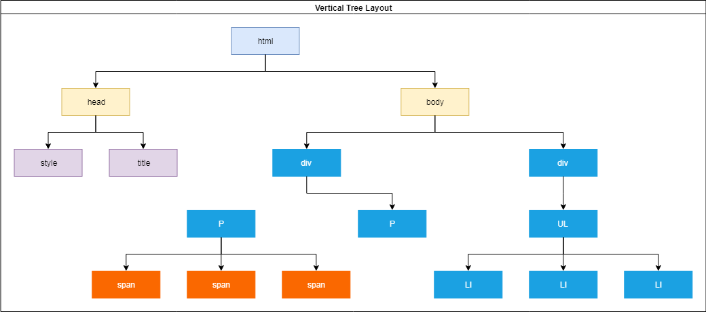

# Front End Website met basic Javascript - Fase 2
In de tweede variant werken we netjes met de broncode van de Javascript in 
een los bestand. Ook de stylesheet is verhuisd naar een los bestand. Typisch zet 
je deze in een eigen map (js en css).

Probleem is wel dat je niet precies weet wanneer je HTML klaar is om te
gebruiken in Javascript. Daarom gebruiken we de functie

```javascript
window.onload
```

Hier kun je een functie (anoniem of functienaam) aan toekennen die uitgevoerd wordt als de
HTML klaar is met laden ([Link naar MDN](https://developer.mozilla.org/en-US/docs/Web/API/GlobalEventHandlers/onload)).

Tevens gaan we aan de slag met het concept van de DOM : het "Document Object Model".

## DOM
Daarna gaan we aan de slag met het maken van een stukje interactieve website: zelf een stukje 
HTML aan de *DOM* toevoegen, zodat we er op kunnen klikken met de muis.

DOM: Document Object Model
Als de browser HTML heeft opgehaald gaat hij een boomstructuur bouwen, waarin alle elementen en object in opgeslagen worden.
We noemen dit de DOM: *het Document Object Model*. In onderstaande afbeelding zie je een voobeeld van zo'n boom.



In de tweede afbeelding hier onder zijn de elementen uitgebreid door er een klasse ('class') of een HTML *id* aan toe te voegen.
Een klasse wordt weergegeven door de naam van het element (P, SPAN, DIV) aan te vullen met een punt ('.') gevolgd door
de klasse naam / namen. Als een element een ID heeft, wordt deze typisch weergegeven met een hash ('#').


Om een element terug te vinden in deze boom, kun je aan het document vragen: waar is het element met een bepaalde ID?
Zorg er dus voor dat een ID uniek is, anders weet je niet de uitkomst van deze vraag.

Deze notatie zul je herkennen uit de CSS-wereld. Immers, als je een element wilt opmaken met een bepaalde ID of klasse
gebruik je dezelfde notatie. Kijkend naar het voorbeeld in bovenstaande afbeelding zo je in CSS het volgende 
kunnen doen:
```css
  span.surname {
     font-weight:bold;
  }
  #mytext {
    margin-left:30px;
    border-left:5px solid lightgrey;
  }
```

In het voorbeeld wordt gebruik gemaakt van de functie `getElementById` (let op dat deze functies in Javascript hoofdletter
gevoelig zijn):
```javascript
var container = document.getElementById("container");
```
Deze functie is beschikbaar binnen het object `document`. De website van MDN vermeld:

> The Document interface represents any web page loaded in the browser and serves as an entry point into the web page's content, which is the DOM tree.

Concreet kun je zeggen dat dit object onder andere het startpunt van de DOM bevat. Je kunt hier de wereld aan operaties op los laten zoals:
  * zoeken met klassenaam
  * zoeken met HTML ID
  * zoeken met CSS-achtige queries
  * elementen maken
  * elementen aan elkaar koppelen
  * elementen (inclusief kinderen) verwijderen
  * etc...
  
In de file `js/examples.js` van dit voorbeeld vindt je dergelijke voorbeeld terug.

Nog een laatste tip: het eerste element van de DOM is te vinden met het volgende statement:
```javascript
var rootElement = document.documentElement;
```
Meestal zal dat het \<HTML\>-element zijn. 

## Referenties:
  * [Document Object Model](https://nl.wikipedia.org/wiki/Document_Object_Model)
  * [GetElementByID](https://developer.mozilla.org/en-US/docs/Web/API/Document/getElementById)
  * [CreateElement](https://developer.mozilla.org/en-US/docs/Web/API/Document/createElement)
  * [documentElement](https://developer.mozilla.org/en-US/docs/Web/API/Document/documentElement)
  * [eventHandler](https://developer.mozilla.org/en-US/docs/Web/API/EventListener)