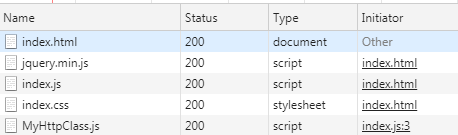

# Opdracht 20 - Modules en Classes 2

Let op onderstaande HTML: er staat een type bij vermeld : `type="module"` 
```html
<script src="js/index.js" type="module"></script>
```

Hiermee geef je aan dat je een Javascript-bestand als **Module** wilt laden. In zo'n module kun je classes, functies en variabelen
van elkaar isoleren. Verder krijg je macht over wat er wel of niet "naar buiten gebracht" wordt. Oftewel: welke classes,
functies of variabelen mogen door anderen gebruikt worden?

Als je iets uit een andere module wilt importeren, dan noteer je dat als volgt:

```javascript
import { MyHttp } from MyHttp.js;
```
Kijk nog even naar de vorm van de `<head>` in de HTML-file:
```html
    <meta charset="UTF-8">
    <title>Opdracht 20</title>
    <script src="jquery/jquery.min.js"></script>
    <script src="js/index.js" type="module"></script>
    <link rel="stylesheet" href="css/index.css">
```

Wat opvalt is dat er slechts één (eigen) javascript-bestand is opgenomen. Deze `index.js` haalt de rest van de code op 
doordat de import-statements gebruikt worden. Als je in de Network-monitor van de browser kijkt, zul je zien dat de 
"initiator" niet de HTML-file is maar de 3e regel uit de Javascript file (`index.js:3` in de laatste regel/kolom):


```javascript

$(document).ready(initPage);

//http://www.omdbapi.com/?apikey=89f91ba6&type=movie&r=json&s=Martin&page=1

function initPage(){
    const strUrl = 'http://www.omdbapi.com/';
    const strAPIKey = '89f91ba6';
    const strType   = 'movie';
    const strResult = 'json';
    const strPage   = '1';
    const strTitle  = 'Martin';

    const URLQuery = $.param({
        type   : strType,
        apikey : strAPIKey,
        r      : strResult,
        s      : strTitle,
        page   : strPage
    });

    const omdbQuery = strUrl + "?" + URLQuery;

    var http = new MyHttp();
    var promise = http.getDataFromIMDB(omdbQuery);

    promise.then(
        data => {
            const items = JSON.parse(data).Search;
            fillTableFromTemplate(
                "omdbdata",
                "ombdrow",
                items
            );
        },
        error => Alert("Er ging iets mis!\n" + error)
    );

}//initPage

function fillTableFromTemplate(idTable, idTemplate, arrData){
    // zoek de template en de tabel op in geladen HTML
  var template = document.getElementById(idTemplate);
  var table    = document.getElementById(idTable);

  // doorloop alle data (arrData is een array, dus gebruik de Array.forEach functie)
  arrData.forEach((item)=>{
      const clone = document.importNode(template.content, true);

      const tdTitle = clone.querySelector(".title");
      const tdYear = clone.querySelector(".year");
      const imgPoster = clone.querySelector(".poster img");

      imgPoster.src       = item.Poster;
      tdTitle.textContent = item.Title;
      tdYear.textContent  = item.Year;

      table.appendChild(clone);
  });
}//fillTableFromTemplate

```

## Referenties
  * [Google: JS Modules](https://developers.google.com/web/fundamentals/primers/modules)
  * [MDN: JS Export](https://developer.mozilla.org/en-US/docs/Web/JavaScript/Reference/Statements/export)
  * [MDN: JS Import](https://developer.mozilla.org/en-US/docs/Web/JavaScript/Reference/Statements/import)
  * [MDN: Tree Shaking](https://developer.mozilla.org/en-US/docs/Glossary/Tree_shaking)
